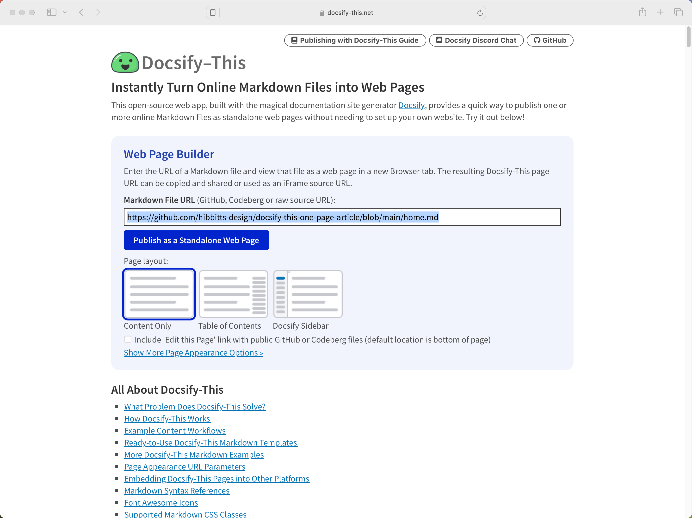

# Publishing with Docsify-This

An introduction to Markdown publishing using the open source [Docsify-This.net](https://docsify-this.net/) project.

## Markdown

### What is Markdown? 
Markdown is a syntax to format the display of content stored as plain text - similar but simpler than HTML formatting

### Why Markdown? 

* System-independent
* Text only format (perfect for version control)
* Separation of content vs. presentation
* Human-readable (i.e. more than HTML)

### Markdown Examples

```
# Your H1 Text Here  
## Your H2 Text Here  

_your italic text here_  

**your bold text here**  

* your unordered list item here  

  1. your numbered (and indented) list item here   

[link title](www.google.com)  
```
Tip: To ensure a new paragraph after text in markdown, put two spaces after the end of the line

## Publishing with Markdown

* Markdown Converters
  * For example, [Pandoc](https://pandoc.org/)
* Markdown Static Site Builders
  * For example, [Jekyll](https://jekyllrb.com/)
* Markdown Dynamic Renderers
  * For example, [Docsify](https://docsify.js.org)

## Docsify-This

Docsify-This is an open source Web app, built using the Docsify Open Publishing Kit, that can quickly display online Markdown files as web pages (i.e. no file uploads or build processes).

Being open source, you can even host your own Docsify-This instance!

### Example Docsify-This Usage Scenarios

* Quickly turn publicly available Markdown files (incl. Open Educational Resources) into Web pages
* Share GitHub hosted Markdown files as Web pages, with an optional 'Edit this Page' link
* Reuse Markdown software documentation in other contexts
* Seamlessly embed constraint-free Markdown/HTML content into an LMS

### Docsify-This Web Page Builder

To use the Docsify-This **Web Page Builder** enter the URL for an online Markdown file and tap the ‘View as Standalone Web Page’ button. The Markdown file will then  be rendered as a standalone Web page with it’s own URL that can then be copied and shared.


_Figure 1. Docsify-This Web Page Builder_

### Example Docsify-This URL

```html
https://docsify-this.net/?basePath=https://raw.githubusercontent.com/hibbitts-design/docsify-this-one-page-article/main&homepage=home.md
```


_Figure 2. Docsify-This Rendered Markdown File_

Docsify-This rendered Web pages are also perfect for embedding, with the ability to visually style Docsify-This pages to the destination platform.

### Docsify-This URL Editing

You can also render other Markdown files in the same repository by directly editing the Docsify-This URL parameter **homepage**, for example:

```html
https://docsify-this.net/?basePath=https://raw.githubusercontent.com/hibbitts-design/docsify-this-one-page-article/main&homepage=anotherfile.md
```

### Docsify-This Web Page Styling

[URL Parameters](https://docsify-this.net/#/?id=page-appearance-url-parameters) (any Markdown file)  
For example, `font-family`, `font-size` and `link-color`  

[Markdown CSS Classes](https://docsify-this.net/#/?id=supported-markdown-css-classes)  
For example, `badge`, `button`, and `row` & `column`

### Embedding Docsify-This Pages

#### Example Docsify-This External URL 


_Figure 3. Docsify-This External URL (used as a Canvas LMS Module)_

```html
https://docsify-this.net?basePath=https://raw.githubusercontent.com/paulhibbitts/cmpt-363/main/docs/222&homepage=week-01.md&toc-narrow=true&font-family=Lato%20Extended,Lato,Helvetica%20Neue,Helvetica, Arial,sans-serif&font-size=1&hide-credits=true
```

#### Example Docsify-This iFrame HMTL


_Figure 4. Docsify-This iFrame_

```html
<p><iframe style="overflow: hidden; border: 0px #ffffff none; background: #ffffff;" src="https://docsify-this.net?basePath=https://raw.githubusercontent.com/paulhibbitts/cmpt-363-222-pages-demo/main&amp;homepage=home.md&amp;font-family=Lato%20Extended,%20Lato,Helvetica%20Neue,%20Helvetica,%20Arial,%20sans-serif&font-size=1&link-color=0374B5&hide-credits=true" width="800px" height="1450px" allowfullscreen="allowfullscreen"></iframe></p>
```

## Git and GitHub

### Git

Git is a free and open source distributed version control system,  originally created by Linus Torvalds in 2005 for development of the Linux kernel. 

#### Version Control

Version control supports the management of changes, called revisions, to files… especially useful for pure text files.


_Figure 5. Local Version Control (source: https://git-scm.com)_

#### Collaboration

As a distributed version control system, Git also support collaboration with multiple contributors.


_Figure 6. Distributed Version Control (source: https://git-scm.com)_

### GitHub

GitHub is an online Git service, providing point-and-click means to create and manage Git repositories.

In addition to supporting the hosting of Git repositories, online editing of repository content is also provided.

#### GitHub Desktop


_Figure 7. GitHub Desktop Mac (source: https://desktop.github.com)_

GitHub Desktop
Locally Store Git/GitHub Repositories
Push and Pull Repository Changes

### Docsify-This + GitHub Markdown Files 


_Figure 8. Docsify-This + GitHub Markdown Files Workflow_

## Additional Resources

* Markdown Format
  * [Markdown Guide](http://markdownguide.org)
  * [Markdown Cheatsheet](http://github.com/adam-p/markdown-here/wiki/Markdown-Cheatsheet)
* Markdown Editors
  * [VSCode](https://code.visualstudio.com/)
  * [Pulsar Beta (was Atom.io)](https://pulsar-edit.dev/)
  * [Typora](https://typora.io/)
* GitHub Desktop
  * [GitHub Desktop App](https://desktop.github.com/)
  * [An Introduction to Version Control Using GitHub Desktop](http://programminghistorian.org/en/lessons/retired/getting-started-with-github-desktop)